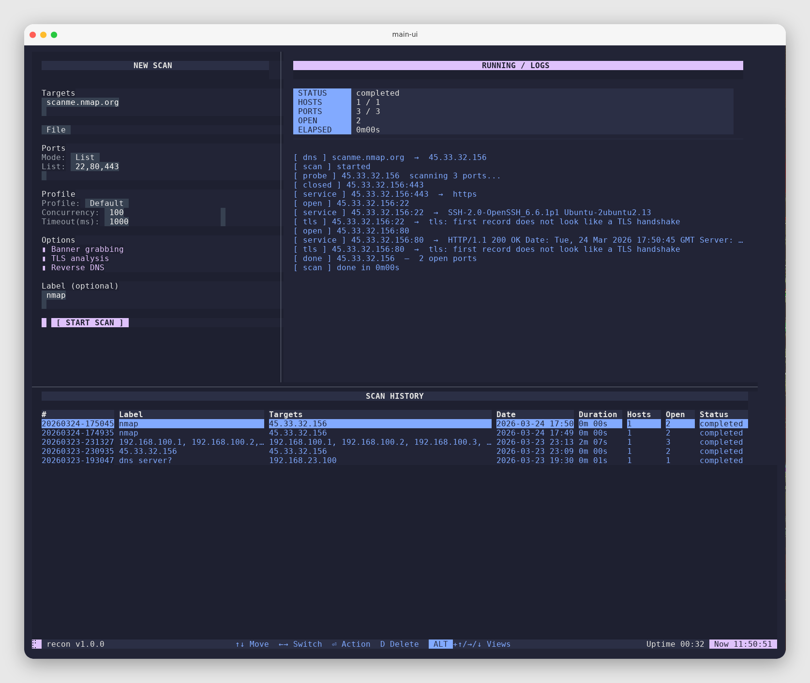
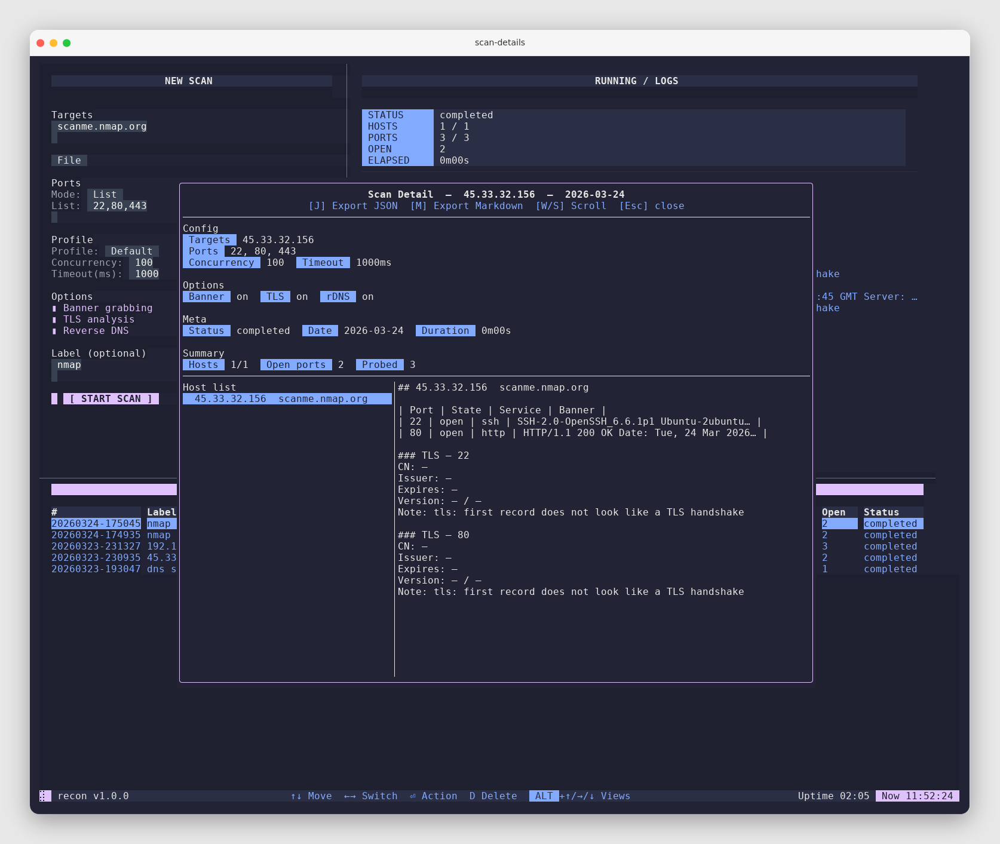

# recon

`recon` is a terminal-based network scanner written in Go. It performs concurrent TCP Connect scans with optional banner grabbing, TLS inspection, and reverse DNS, and presents results in a focused TUI optimized for fast triage.

[:fontawesome-brands-github: View Repository](https://github.com/dontpanicx-13/recon){ .md-button }
[:fontawesome-solid-tag: Releases](https://github.com/dontpanicx-13/recon/releases){ .md-button }
[:fontawesome-solid-bug: Issues](https://github.com/dontpanicx-13/recon/issues){ .md-button }

## Highlights

- Native Go scanner with concurrent workers (no external scan tooling).
- Multiple target types: single IP, domain, CIDR, lists, and files.
- Port modes: presets, ranges, and explicit lists.
- Built-in report export (Markdown) and JSON persistence.
- Reproducible port presets derived from Nmap `nmap-services`.

## About & Value

`recon` focuses on fast, repeatable network assessment with a clean terminal workflow. It combines a native Go scanner, structured results, and a keyboard-first TUI. 

- **Reliable scanning**: concurrent worker pool with configurable timeouts and profiles.
- **Actionable output**: JSON persistence and Markdown export for reporting.
- **Operator-friendly UX**: focused views, clear controls, and fast navigation.

## Where to Start

- New user: see `Quickstart`.
- Configure scanning: see `Configuration`.
- Understand UI navigation: see `Controls`.
