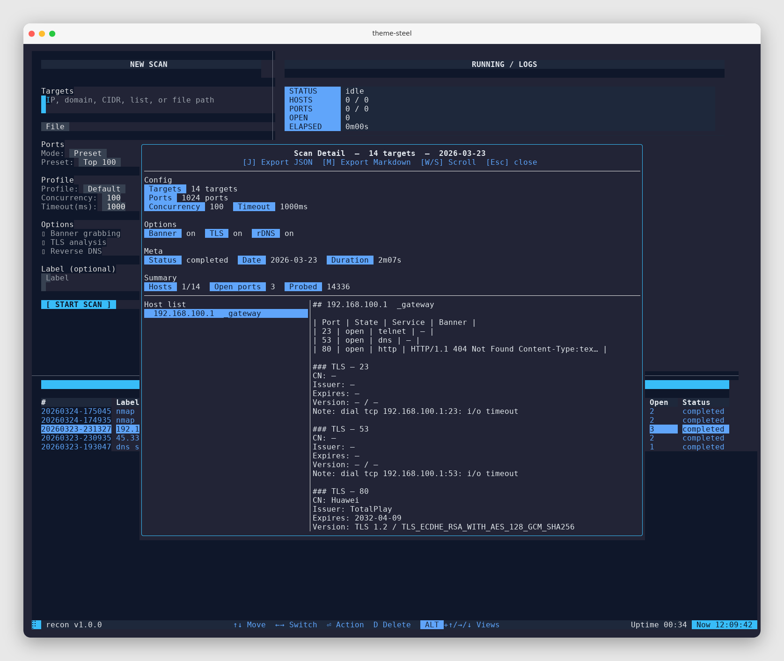
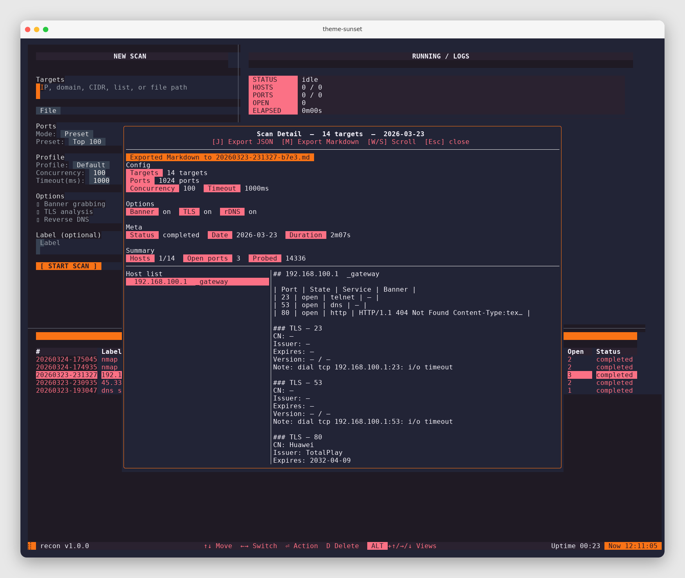
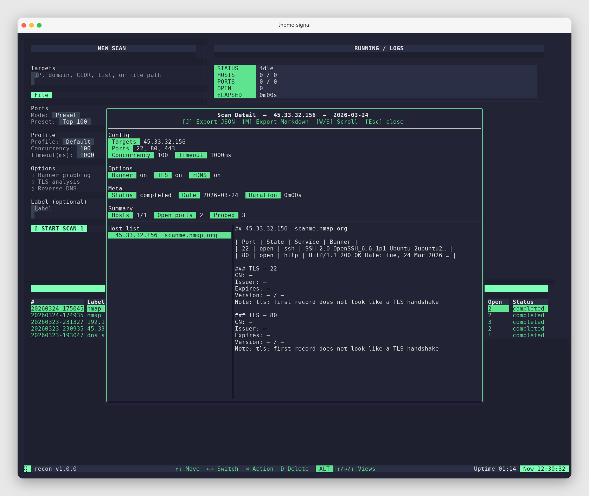

# Theming

`recon` loads colors from `ui_colors.json` in the working directory. If the file is missing or invalid, defaults are used.

Create or edit `ui_colors.json` in the project root.

## Theme: Steel (cool blue)

Create `ui_colors.json` with:

```json
{
  "app_bg": "#0f172a",
  "accent_bg": "#38bdf8",
  "accent_fg": "#0f172a",
  "status_bg": "#1e293b",
  "status_fg": "#e2e8f0",
  "spinner_fg": "#22c55e",
  "controls_fg": "#60a5fa"
}
```




## Theme: Sunset (warm)

Create `ui_colors.json` with:

```json
{
  "app_bg": "#1f1a24",
  "accent_bg": "#f97316",
  "accent_fg": "#1f1a24",
  "status_bg": "#2a2231",
  "status_fg": "#f5f3ff",
  "spinner_fg": "#facc15",
  "controls_fg": "#fb7185"
}
```




## Theme: Signal (green)

Create `ui_colors.json` with:

```json
{
  "app_bg": "#1e2030",
  "accent_bg": "#7dffb5",
  "accent_fg": "#1e2030",
  "status_bg": "#2b2f45",
  "status_fg": "#e6e6e6",
  "spinner_fg": "#7dffb5",
  "controls_fg": "#5ee38f"
}
```




## Keys

| Key | Description |
| --- | --- |
| `app_bg` | application background |
| `accent_bg` / `accent_fg` | focused controls and highlights |
| `status_bg` / `status_fg` | status bar and panel titles |
| `spinner_fg` | spinner color |
| `controls_fg` | control hints color |
